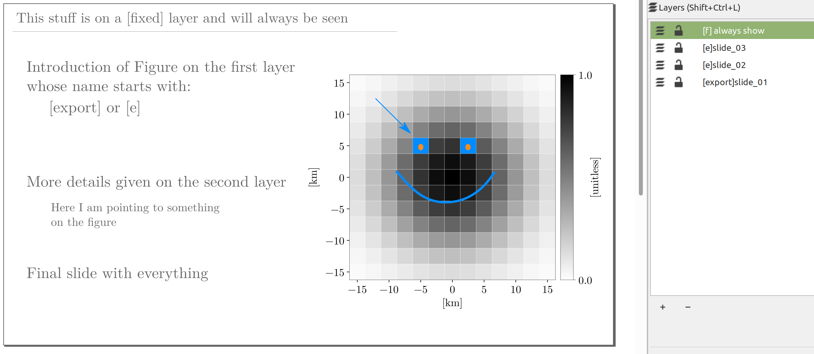
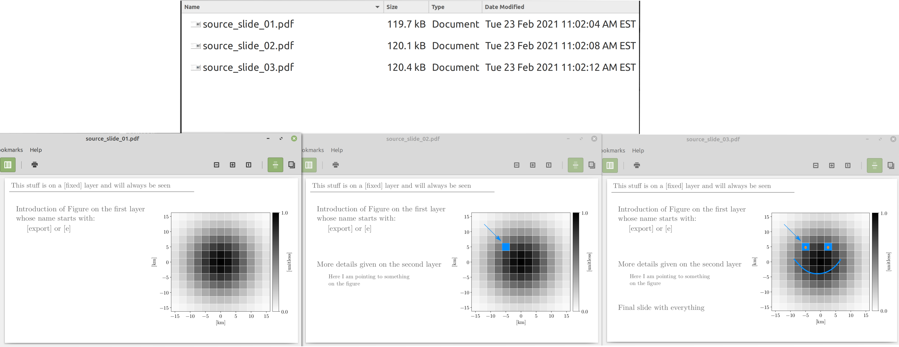
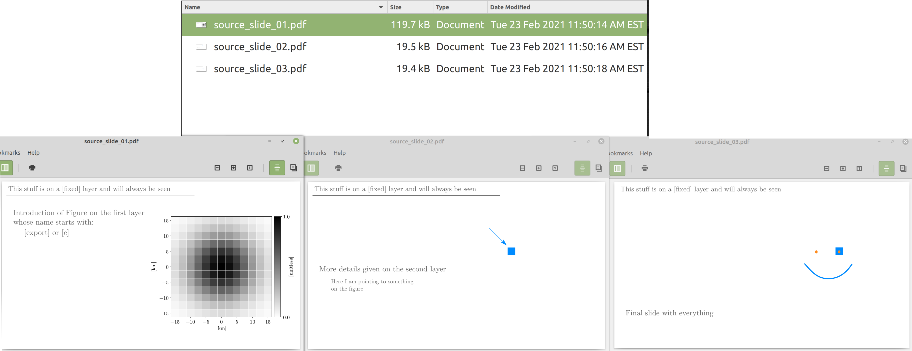

# Inkscape Export Layers 3.0.1

Inkscape extension to export SVG layers as standalone PDF, PNG, SVG or JPEG images.
The exported images can progressively reveal content of an Inkscape document. 

This version works with Inkscape version 1.

The code here heavily relies on previous work by github users: @jespino and @dmitry-t. Great thanks to you both!
Let me know if anyone else deserves credit for this. 

## How it works

There are two options for your layers when exporting:
- `[fixed] or [f]`: If a layer label starts with the prefix `[fixed]` or `[f]` this layer is always exported and
combined with other layers. It is very useful for backgrounds or fixed elements.
- `[export] or [e]`: If a layer label starts with `[export]` or `[e]` this layer is exported along with any `[fixed]` layer and
combined into a single image. With the option `Progressively reveal elements of a figure`, exported layers are included one by one
to the output images. 

The order of layers remains untouched during export, i.e. a higher layer in the layer list is drawn above lower layers.

**Example**



The layer `[f] always_show` is a fixed layer and will always be exported combined with the `[export]` layers.

With the `Progressively reveal elements of a figure` checked, elements of the figures are progressively revealed.


Without this option, elements of the figures are only composed of the fixed layer(s) and individual exported layers. 



## How to use

To use the extension once your layers are ready:

1. Get the code from the github page. (`Code -> Download ZIP` if you are unfamiliar with git clone)
1. Put the `inkscape-export-layers` directory where Inkscape will find it. (`~/.config/inkscape/extensions/` will work for your user on linux)
1. Open Inkscape
1. Go to `Extensions` > `Export` > `Export layers...`
1. Follow instructions in pop-up dialog and set options for your export
1. Click `Apply`.

## Requirements

1. Make sure the 'Inkscape' program is available from the command line. This may not be the case if you are using flatpack installation.

## Use with beamer

I mainly use this extension to make presentation with LateX+Beamer. Here are a few steps that will get you started in this direction.

1. Pick a 16-9 aspect ratio for your source Inkscape document. 
1. Setup the layers you want to export in the order that you would like. 
1. Use the `Export layers` to output your figures
1. Include the exported figures in the Beamer `.tex` file
   ```
   \documentclass[aspectratio=169,14pt]{beamer}
   \usepackage{textpos}
   \RequirePackage{graphicx}
   \begin{document}
   
   %a block that progressively reveals content of Inkscape svg file
   \begin{frame}
       \begin{textblock*}{\paperwidth}(-1cm,-3.546cm)
           \includegraphics<1>[width=\paperwidth]{layers/source_slide_01.pdf}
           \includegraphics<2>[width=\paperwidth]{layers/source_slide_02.pdf}
           \includegraphics<3>[width=\paperwidth]{layers/source_slide_03.pdf}
       \end{textblock*}
   \end{frame}
   
   \end{document}
   ```
1. Compile  (I highly recommend `latexmk -pdf` which will handle compilation on its own and recompile when source files change)

